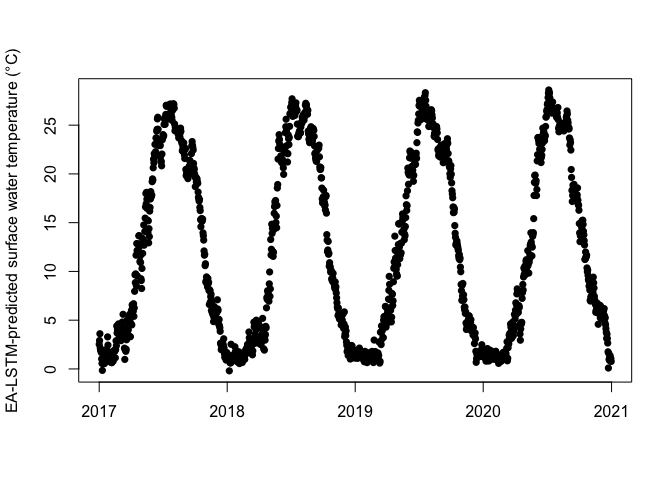
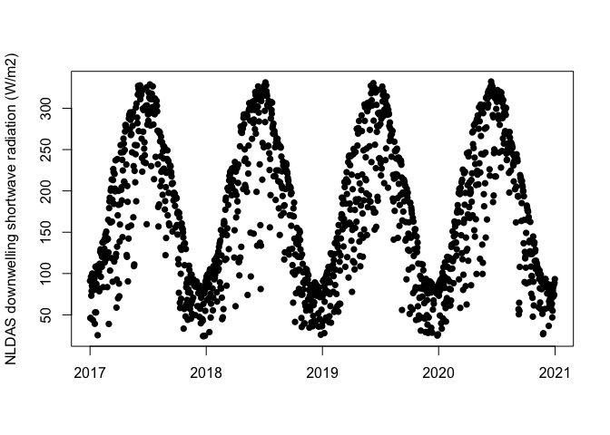
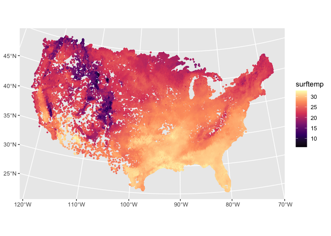

Example data use: Continuous surface temperatures for 185,000 lakes in
the Contiguous United States estimated using deep learning (1980-2020)
================
Jordan S. Read
8/25/2021

## download files

This example assumes you have downloaded files from the “Continuous
surface temperatures for 185,000 lakes in the Contiguous United States
estimated using deep learning (1980-2020)” data release at
<https://doi.org/10.5066/P9CEMS0M> Those files can be placed anywhere
accessible to you, but for this example, they were downloaded into a
directory called ‘downloaded\_files’

``` r
library(tidyverse) # I used packageVersion 1.3.1 for this
```

    ## ── Attaching packages ─────────────────────────────────────── tidyverse 1.3.1 ──

    ## ✓ ggplot2 3.3.4     ✓ purrr   0.3.4
    ## ✓ tibble  3.1.3     ✓ dplyr   1.0.7
    ## ✓ tidyr   1.1.3     ✓ stringr 1.4.0
    ## ✓ readr   1.4.0     ✓ forcats 0.5.1

    ## ── Conflicts ────────────────────────────────────────── tidyverse_conflicts() ──
    ## x dplyr::filter() masks stats::filter()
    ## x dplyr::lag()    masks stats::lag()

``` r
library(ncdf4) # I used packageVersion 1.17 for this

data_dir <- 'downloaded_files'
```

## find data for *one* lake

Here, we’re looking for information on a single lake. For this example,
I used Smith et al., 2021 to find a lake identifier for Lake Mendota, WI

Smith, N.J., K.E. Webster, L.K. Rodriguez, K.S. Cheruvelil, and P.A.
Soranno. 2021. LAGOS-US LOCUS v1.0: Data module of location,
identifiers, and physical characteristics of lakes and their watersheds
in the conterminous U.S. ver 1. Environmental Data Initiative.
<https://doi.org/10.6073/pasta/e5c2fb8d77467d3f03de4667ac2173ca>
(Accessed 2021-08-24).

``` r
mendota_lake_nhdid <- "nhdhr_143249470" # from LAGOS-US lake_nhdid, for lagoslakeid = 5371
```

Read in the metadata file:

``` r
all_metadata <- read_csv(file.path(data_dir, 'lake_metadata.csv'))
```

    ## 
    ## ── Column specification ────────────────────────────────────────────────────────
    ## cols(
    ##   site_id = col_character(),
    ##   weather_id = col_character(),
    ##   num_obs = col_double(),
    ##   area_m2 = col_double(),
    ##   elevation_m = col_double(),
    ##   lake_lon_deg = col_double(),
    ##   lake_lat_deg = col_double(),
    ##   weather_lon_deg = col_double(),
    ##   weather_lat_deg = col_double(),
    ##   RMSE_EALSTM = col_double(),
    ##   RMSE_LM = col_double(),
    ##   RMSE_ERA5 = col_double(),
    ##   cluster_id = col_double(),
    ##   fold_id = col_double(),
    ##   group_bbox = col_character(),
    ##   group_id = col_character()
    ## )

``` r
all_metadata
```

    ## # A tibble: 185,549 × 16
    ##    site_id      weather_id num_obs area_m2 elevation_m lake_lon_deg lake_lat_deg
    ##    <chr>        <chr>        <dbl>   <dbl>       <dbl>        <dbl>        <dbl>
    ##  1 nhdhr_{C090… nldas_x1_…       0  3.65e6          15        -125.         48.8
    ##  2 nhdhr_{588D… nldas_x1_…       0  4.27e5         108        -125.         48.8
    ##  3 nhdhr_{73F4… nldas_x1_…       0  2.70e7           4        -125.         48.7
    ##  4 nhdhr_{B8A9… nldas_x1_…       0  2.43e5          36        -125.         48.7
    ##  5 nhdhr_{8AE1… nldas_x1_…       0  1.37e6           6        -125.         48.7
    ##  6 nhdhr_{476C… nldas_x1_…       0  1.05e6          32        -125.         48.7
    ##  7 nhdhr_{4B35… nldas_x1_…       0  1.32e5          17        -125.         48.7
    ##  8 nhdhr_{74AE… nldas_x2_…       0  1.51e5         229        -125.         49.0
    ##  9 nhdhr_{4589… nldas_x2_…       0  4.20e5         226        -125.         49.0
    ## 10 nhdhr_{78FF… nldas_x2_…       0  1.50e5         197        -125.         48.9
    ## # … with 185,539 more rows, and 9 more variables: weather_lon_deg <dbl>,
    ## #   weather_lat_deg <dbl>, RMSE_EALSTM <dbl>, RMSE_LM <dbl>, RMSE_ERA5 <dbl>,
    ## #   cluster_id <dbl>, fold_id <dbl>, group_bbox <chr>, group_id <chr>

use this lake ID to filter the metadata to just Lake Mendota:

``` r
mendota_info <- filter(all_metadata, site_id == mendota_lake_nhdid)
mendota_info
```

    ## # A tibble: 1 × 16
    ##   site_id         weather_id num_obs area_m2 elevation_m lake_lon_deg lake_lat_deg
    ##   <chr>           <chr>        <dbl>   <dbl>       <dbl>        <dbl>        <dbl>
    ## 1 nhdhr_143249470 nldas_x28…    2755  3.95e7         257        -89.4         43.1
    ## # … with 9 more variables: weather_lon_deg <dbl>, weather_lat_deg <dbl>,
    ## #   RMSE_EALSTM <dbl>, RMSE_LM <dbl>, RMSE_ERA5 <dbl>, cluster_id <dbl>,
    ## #   fold_id <dbl>, group_bbox <chr>, group_id <chr>

Now, use the information in the metadata table to construct a file name
for the prediction and weather NetCDF files that contain Lake Mendota.
Since there are three files for prediction and weather data, you’ll need
to read data from the right one (assumes you have downloaded data
release files to your local directory, which in this case is
“downloaded\_files/”):

``` r
predict_fl <- file.path(data_dir, sprintf("%s_predicted_temp_%s.nc", mendota_info$group_id, mendota_info$group_bbox))
weather_fl <- file.path(data_dir, sprintf("%s_weather_%s.nc", mendota_info$group_id, mendota_info$group_bbox))
# check ?sprintf() if you are unfamiliar with it

# make sure you have this file locally:
file.exists(predict_fl)
```

    ## [1] TRUE

Open up the NetCDF file and access the time information and use that to
pull data from predicted temperatures of Lake Mendota.

``` r
nc <- nc_open(predict_fl)
# look at the format of this file:
nc
```

    ## File tmp/02_predicted_temp_N40-53_W67-98.nc (NC_FORMAT_NETCDF4):
    ## 
    ##      4 variables (excluding dimension variables):
    ##         double alt[site_id]   (Chunking: [59476])  (Compression: shuffle,level 1)
    ##             units: m
    ##             missing_value: -999
    ##             long_name: approximate elevation of lake surface
    ##             standard_name: height
    ##         double lat[site_id]   (Chunking: [59476])  (Compression: shuffle,level 1)
    ##             units: degrees_north
    ##             missing_value: -999
    ##             long_name: latitude of lake centroid
    ##             standard_name: latitude
    ##         double lon[site_id]   (Chunking: [59476])  (Compression: shuffle,level 1)
    ##             units: degrees_east
    ##             missing_value: -999
    ##             long_name: longitude of lake centroid
    ##             standard_name: longitude
    ##         double surftemp[time,site_id]   (Chunking: [10,59476])  (Compression: shuffle,level 1)
    ##             units: °C
    ##             missing_value: -2147483648
    ##             long_name: Surface water temperature [°C]
    ##             coordinates: time lat lon alt
    ##             least_significant_digit: 2
    ## 
    ##      3 dimensions:
    ##         site_id  Size:59476
    ##             long_name: identifier for the lake location; NHDHR PermID
    ##             cf_role: timeseries_id
    ##         site_id_char  Size:44
    ## [1] "vobjtovarid4: **** WARNING **** I was asked to get a varid for dimension named site_id_char BUT this dimension HAS NO DIMVAR! Code will probably fail at this point"
    ##         time  Size:14976
    ##             units: days since 1970-01-01 00:00:00
    ##             missing_value: -999
    ##             long_name: date of prediction
    ##             standard_name: time
    ## 
    ##     4 global attributes:
    ##         Conventions: CF-1.8
    ##         featureType: timeSeries
    ##         cdm_data_type: Station
    ##         standard_name_vocabulary: CF-1.8

The “site\_id” (also a value in the lake metadata table) is used to
uniquely identify each lake. We need to figure out which index
(shortened to `idx` here) Lake Mendota’s site\_id is located in:

``` r
mendota_predict_idx <- ncvar_get(nc, 'site_id') %>% {. == mendota_lake_nhdid} %>% which()
```

We’re using a subset of the time period here to show that you don’t
always have to access all of the data at once.

``` r
time_origin <- ncdf4::ncatt_get(nc, 'time', attname = 'units')$value %>% str_remove("days since ")
time <- ncvar_get(nc, 'time') + as.Date(time_origin)
# Find the time index when 2017 starts. Since the dataset goes all the way to 1980, we'll use this index to access a subset of the data
time_start <- which(time == as.Date('2017-01-01'))
time_end <- length(time)
# see ?ncdf4::ncvar_get if you need help with what these argument values mean
mendota_surftemp <- ncvar_get(nc, 'surftemp', start = c(time_start, mendota_predict_idx), count = c(-1, 1))
nc_close(nc)
```

The same access pattern can be used to access weather data. But, since
weather is organized according to lat/lon cells, the `weather_id` (also
a value in the lake metadata table) is the unique identifier for weather
locations, since some cells cover more than one lake.

``` r
nc <- nc_open(weather_fl)
mendota_weather_idx <- ncvar_get(nc, 'weather_id') %>% {. == mendota_info$weather_id} %>% which()
mendota_shortwave <- ncvar_get(nc, 'dswrfsfc', start = c(time_start, mendota_weather_idx), count = c(-1, 1))
nc_close(nc)
```

Now plot the data for surface temperature and shortwave radiation:

``` r
plot(time[time_start:time_end], mendota_surftemp, xlim = as.Date(c('2017-01-01','2020-12-31')), 
     pch = 16, xlab = '', ylab = 'EA-LSTM-predicted surface water temperature (°C)')
```

<!-- -->

``` r
plot(time[time_start:time_end], mendota_shortwave, xlim = as.Date(c('2017-01-01','2020-12-31')), 
     pch = 16, xlab = '', ylab = 'NLDAS downwelling shortwave radiation (W/m2)')
```

<!-- -->

## access data for all lakes (within a single file) at once

Adding the sf package and also specifying a single time that we’re
interested in, July 1st of 2017 in this example:

``` r
library(sf) # I used packageVersion 0.9.8 for this
```

    ## Linking to GEOS 3.9.1, GDAL 3.2.1, PROJ 7.2.1

``` r
time_idx <- which(time == as.Date('2017-07-01'))
```

Open back up the prediction file. Keep in mind this is one of three
prediction files, so if you want data for the complete Contiguous U.S.,
you need to combine data from all three files.

Set the data up to be ready to plot for the whole dataset:

``` r
pred_fls <- all_metadata %>% mutate(filepath = file.path(data_dir, sprintf("%s_predicted_temp_%s.nc", group_id, group_bbox))) %>%
  pull(filepath) %>% unique()

plot_data <- purrr::map(pred_fls, function(pred_fl){
    nc <- nc_open(pred_fl)
    # get temperature for a single day but for all lakes at once:
    all_surftemp <- ncvar_get(nc, 'surftemp', start = c(time_idx, 1), count = c(1, -1))
    lake_lat <-  ncvar_get(nc, 'lat')
    lake_lon <-  ncvar_get(nc, 'lon')
    nc_close(nc)
    tibble(surftemp = all_surftemp, lat = lake_lat, lon = lake_lon)
  }) %>% bind_rows() %>% 
  st_as_sf(coords = c("lon", "lat"), crs = 4326) %>% 
  st_transform("+proj=lcc +lat_1=30.7 +lat_2=29.3 +lat_0=28.5 +lon_0=-91.33333333333333 +x_0=999999.9999898402 +y_0=0 +ellps=GRS80 +datum=NAD83 +to_meter=0.3048006096012192 +no_defs")
```

Plot July 1st temperatures estimated for these lakes using ggplot2:

``` r
ggplot() +
  geom_sf(data = plot_data, size = 0.5, aes(col=surftemp)) + 
  scale_colour_viridis_c(option = "magma")
```

<!-- -->

### Python

This example uses python3. I installed fsspec, xarray, hvplot, s3fs,
h5netcdf, dask, pykdtree, scipy, pyproj, datashader, and GeoViews. This
example was created based off of Rich Signell’s notebook

``` python
import fsspec
import xarray as xr
import numpy as np
import hvplot.pandas
import geoviews as gv
from holoviews.operation.datashader import rasterize

url = 's3://prod-is-usgs-sb-prod-publish/60341c3ed34eb12031172aa6/01_predicted_temp_N24-53_W98-126.nc'
```

verify we have access

``` python
fs = fsspec.filesystem('s3', anon=True)
fs.size(url)
[1] 1180271102
```

open the dataset and request chunks:

``` python
ds = xr.open_dataset(fs.open(url), chunks={'time':24})
ds.surftemp
<xarray.DataArray 'surftemp' (site_id: 62560, time: 14976)>
dask.array<open_dataset-75f138412ff0f0130631cfe4fbaae841surftemp, shape=(62560, 14976), dtype=float64, chunksize=(62560, 24), chunktype=numpy.ndarray>
Coordinates:
    alt      (site_id) float64 dask.array<chunksize=(62560,), meta=np.ndarray>
    lat      (site_id) float64 dask.array<chunksize=(62560,), meta=np.ndarray>
    lon      (site_id) float64 dask.array<chunksize=(62560,), meta=np.ndarray>
  * site_id  (site_id) |S44 b'nhdhr_{C0902D8E-5338-4023-B399-F6758BDDD6A1}' ....
  * time     (time) datetime64[ns] 1980-01-01 1980-01-02 ... 2020-12-31
Attributes:
    units:                    °C
    long_name:                Surface water temperature [°C]
    least_significant_digit:  [2]
```

define a plotting function for use later

``` python
def plot_surftemp(da, label=None):
    # Convert Xarray to Pandas dataframe so we can use hvplot.points for visualization
    df = da.to_pandas().to_frame()
    #The dataframe just has streamflow, so add longitude and latitude as columns
    df = df.assign(latitude=ds['lat'])
    df = df.assign(longitude=ds['lon'])
    df.rename(columns={0: "surftemp"}, inplace=True)
    p = df.hvplot.points('longitude', 'latitude', geo=True,
                     c='surftemp', colorbar=True, size=14, label=label)
    return (p * gv.tile_sources.OSM)
```

select a time slice and plot

``` python
select_time = '2017-06-01'
var = 'surftemp'
da = ds[var].sel(time=select_time)
plot_surftemp(da, label=f'{var}:{select_time}')
```
